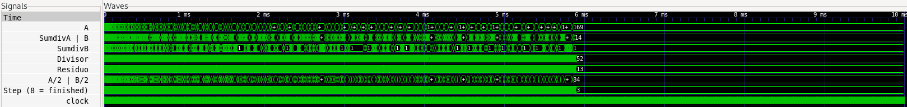
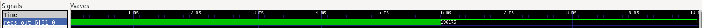
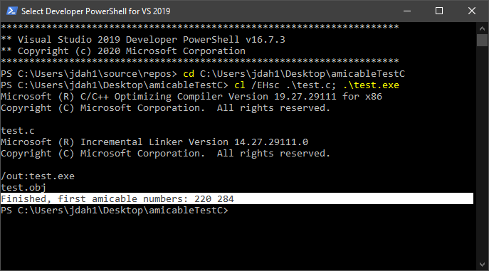
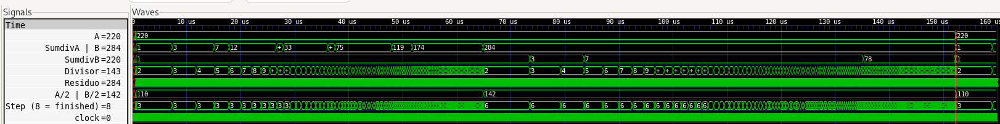
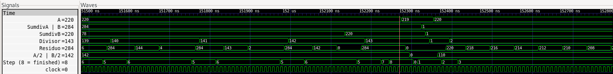
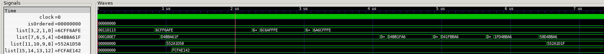
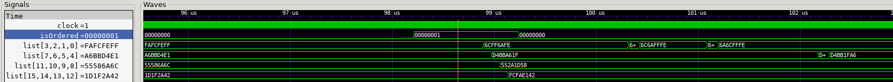
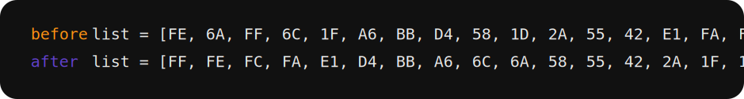

# Workshop RISC-V

En el workshop se desarrollan 2 ejercicios, uno en assembly y otro en C con la ISA RISC-V, y se simulan, a continuación se presentan los resultados y como obtenerlos

Requisitos:
- [RISC-V GNU Compiler Toolchain](https://github.com/riscv-collab/riscv-gnu-toolchain)
- [Iverilog](https://iverilog.fandom.com/wiki/Installation_Guide)

## Números Amigos (Assembly)

Denifiendo d(n) como la suma de los divisores propios de n, si d(a) = b y d(b) = a, donde a es diferente de b, entonces a y b son un par de números amigos. El programa encuentra el par de números amigos más pequeños.

### [Diagrama de flujo](res/amicableFlowchart.pdf) 

### Pasos para ser ejecutado

Ejecutar los siguientes comandos en la carpeta raíz del repositorio:

#### Programa de números amigos

```bash
./doasm.sh assembly/projects/amicable.S
cd verilog
iverilog -o test *.v
vvp test
gtkwave -o test.vcd
cd ..
```
#### Programa test

```bash
./doasm.sh assembly/projects/test.S
cd verilog
iverilog -o test *.v
vvp test
gtkwave -o test.vcd
cd ..
```

### Resultados de la simulación

Nota: Se sugiere dar click en las imágenes de simulación para verlas mejor

Antes de simular se aumentó el tiempo de simulación a `10000000ns` en `verilog/Ottochip_tb.v` 

Durante la simulación del programa `amicable.S`, se llegó a un punto donde al parecer el procesador dejó de ejecutar instrucciones (por lo tanto no termina de ejecutarse)



Para asegurarse de que no era un problema del programa `amicable.S`, se simuló un programa (`test.S`) donde se le suma 1 a una variable temporal con el mismo tiempo de simulación



Además se escribió un programa en C basado en el programa en `amicable.S` y se ejecutó en windows



Como se puede ver el programa funciona correctamente encontrando los dos primeros números amigos. Para compilar y correr el programa (se requiere de gcc `sudo apt install build-essential`):

```bash
gcc assembly/projects/amicableTestC/test.c -o assembly/projects/amicableTestC/test
./assembly/projects/amicableTestC/test
```

Para demostrar el correcto funcionamiento del programa se simuló empezando la variable A en 219 (Sabiendo que el primer número amigo que se encuentra es 220), el tiempo de simulación que se utilizó para este fue de `160000ns` 




Nota: En el programa se utiliza resta para encontrar si un número es divisible entre otro, no se utilizó la instrucción `rem` (remainder) ya que al probar no funcionaba, aunque no sabemos por que, ya que al revisar los comandos para compilar, en la opción `march` aparentemente se incluía la extensión RVM (`-march=rv32im`), pero al usar instrucciones de la extensión no se obtenían resultados

### Instrucciones utilizadas

Lista de instrucciones diferentes:
- li
- add
- addi
- srli
- blt
- sub
- bnez
- beq
- bne
- j

Cantidad (según el script): 70

## Ordenar Array (C program)

El programa ordena una lista de 16 enteros de 8 bits sin signo de mayor a menor (list[0] contiene el mayor, list[15] contiene el menor), la lista contiene valores predefinidos al azar

Para eso se utilizan los registros de regtest1 (reg0, reg1, reg2, reg3) como una lista de 16 valores enteros sin signo de 8 bits, y se cargan valores al azar, y el reg0 de regtest2 se utiliza para indicar cuando la lista esté ordenada

### [Diagrama de flujo](res/orderFlowchart.pdf) 

### Pasos para ser ejecutado

Se utilizó un tiempo de simulación de `160000ns`

Ejecutar los siguientes comandos en la carpeta raíz del repositorio

```bash
./compile.sh c_program/order.c
cd verilog
iverilog -o test *.v
vvp test
gtkwave test.vcd
cd ..
```

### Resultados de la simulación

Inicio de la simulación, se muestra cuando se cargan los valores aleatorios a la lista


Punto de la simulación donde se indica que la lista está ordenada


Visualización de la lista antes y después de ordenarse (lista = [lista[0], lista[1] ... lista[15]])


### Instrucciones utilizadas

Lista de instrucciones diferentes (según el script):
- li    
- lui   
- mv    
- auipc 
- addi  
- sw    
- jal   
- j     
- sb    
- lw    
- lbu   
- add   
- bgeu  
- bltu  
- beqz  
- nop
- ret

Cantidad (según el script): 129

### Referencias

- [Amicable Numbers](https://projecteuler.net/archives)  
- [RISC-V ISA Specifications](https://riscv.org/technical/specifications/)
- [Guía Práctica de RISC-V: El Atlas de una Arquitectura Abierta](http://riscvbook.com/spanish/)
