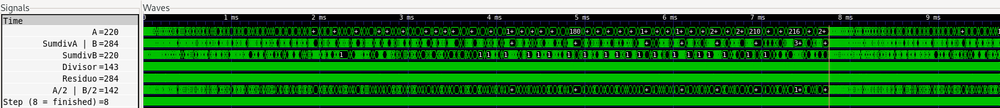
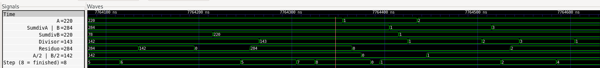

# Workshop RISC-V

En el workshop se desarrollan 2 ejercicios, uno en assembly y otro en C con la ISA RISC-V, y se simulan, a continuación se presentan los resultados y como obtenerlos

Requisitos:
- [RISC-V GNU Compiler Toolchain](https://github.com/riscv-collab/riscv-gnu-toolchain)
- [Iverilog](https://iverilog.fandom.com/wiki/Installation_Guide)

## Números Amigos (Assembly)

Denifiendo d(n) como la suma de los divisores propios de n, si d(a) = b y d(b) = a, donde a es diferente de b, entonces a y b son un par de números amigos. El programa encuentra el par de números amigos más pequeños.

### [Diagrama de flujo](res/amicableFlowchart.pdf) 

### Pasos para ser ejecutado

Ejecutar los siguientes comandos en la carpeta raíz del repositorio:

#### Programa de números amigos

```bash
./doasm.sh assembly/projects/amicable.S
cd verilog
iverilog -o test *.v
vvp test
gtkwave -o test.vcd
cd ..
```
#### Programa test

```bash
./doasm.sh assembly/projects/test.S
cd verilog
iverilog -o test *.v
vvp test
gtkwave -o test.vcd
cd ..
```

### Resultados de la simulación

Nota: Se sugiere dar click en las imágenes de simulación para verlas mejor

Antes de simular se aumentó el tiempo de simulación a `10000000 ns` en `verilog/Ottochip_tb.v` 

Durante la simulación del programa `amicable.S`, se llegó a un punto donde al parecer el procesador dejó de ejecutar instrucciones (por lo tanto no termina de ejecutarse)


Para asegurarse de que no era un problema del programa `amicable.S`, se simuló un programa (`test.S`) donde se le suma 1 a una variable temporal con el mismo tiempo de simulación


para el programa `test.S`, la variable temporal cambia por última vez en `5885795 ns`, que es también el tiempo donde el procesador deja de funcionar para la simulación del programa `amicable.S`

Además se escribió un programa en C basado en el programa `amicable.S` y se ejecutó en windows


Como se puede ver el programa funciona correctamente encontrando los dos primeros números amigos. Para compilar y correr el programa (se requiere de gcc `sudo apt install build-essential`):

```bash
gcc assembly/projects/amicableTestC/test.c -o assembly/projects/amicableTestC/test
./assembly/projects/amicableTestC/test
```

Para demostrar el correcto funcionamiento del programa se simuló empezando la variable A en 219 (Sabiendo que el primer número amigo que se encuentra es 220), el tiempo de simulación que se utilizó para este fue de `160000 ns` 


Nota: En el programa se utiliza resta para encontrar si un número es divisible entre otro, no se utilizó la instrucción `rem` (remainder) ya que al probar no funcionaba, aunque no sabemos por que, ya que al revisar los comandos para compilar, en la opción `march` aparentemente se incluía la extensión RVM (`-march=rv32im`), pero al usar instrucciones de la extensión no se obtenían resultados

#### Como arreglar este problema?

Se trató de solucionar el hecho de que el programa tomara muchas iteraciones, para eso se escribio una versión optimizada del programa, que se llama `amicableFast.S`, los cambios que se hicieron están relacionados con la manera en que se encuentran divisores.

Se volvio a correr la simulación, pero, aunque llegó a un número mas alto, no terminó de ejecutarse ya que el procesador dejo de funcionar en los mismos `5885795 ns`.

##### Por que no termina la simulación?

Para revisar por qué no terminaba la simulación (es decir, por qué el procesador no seguía ejecutando instrucciones), se empezaron a revisar todas las señales para cada módulo, empezando desde el módulo superior, y se miró que señales cambiaban para un tiempo cercano al de `5885795 ns` (tiempo donde el procesador dejaba de funcionar), se encontraron ciertas señales que cerca a ese tiempo, cambiaban de 0 a 1, y se iba revisando en `Ottochip.v` que hacía que esas señales cambiaran. Después de buscar en varios módulos, se llegó a unas señales que dependían de señales generadas (tipo _T_4, etc) por lo que no se siguió investigando por ese lado, a lo que si se llegó, es que estaba relacionado con el UART.

Entonces se revisó el testbench `Ottochip_tb.v`, y se vio que se enviaban ciertos datos al UART en un bloque `initial begin` que se ejecutaba en paralelo con otro bloque `initial begin` que era el que guardaba los datos de la simulación.

En la parte donde se enviaban datos al UART, se ejecutaban funciones, que duraban un múltiplo de `TB_ns = 1000000000/BAUD_RATE` donde `BAUD_RATE = 9600`, entonces para saber en que función se encontraba el fallo, se tomó el tiempo en donde dejaba de funcionar el simulador, y se dividió en `TB_ns`, dando `N_TB_ns = 5885795/TB_ns`, esto dio `56.503632` es decir, después de `56` delays de `TB_ns` es que se encontraba el fallo.

Ahora, al principio del primer `initial begin` se encuentra un delay de `CLOCK_PERIOD*20`, este no lo tuvimos en cuenta porque no era muy grande el valor, después hay un delay de `TB_ns*3`, [van `3` delays], después se ejecuta la función `uart_send()` la cuál tiene `9` delays de `TB_ns` [van `12` delays] (1 delay solo, un for de 0 a 7, con un delay en cada ciclo, y después al final otro delay solo), y después se ejecuta la función `send_word()` la cual tiene `41` delays [van `53` delays] (tiene 5 delays, y llama 4 veces a `uart_send()`), y después se ejecuta la función `send_word()` denuevo, ya pasandose de los `56` delays donde se supone que sucede el error, es decir, el error se debe presentar en `send_word(32'h8);`.

Lo que hicimos entonces fue comentar todas las llamadas a `send_word()` porque asumimos que no eran importantes, después de eso volvimos a simular y el procesador funcionó correctamente.

###### Simulación arreglada

Se muestran los resultados con el testbech arreglado y utilizando el programa `amicableFast.S` para obtener el resultado en menos tiempo

El tiempo de simulación es de `10000000 ns`

**WARNING:** Para este tiempo de simulación se obtiene un `.vcd` de **5.5 GiB**

Para simular: ejecutar los siguientes comandos en la carpeta raíz del repositorio

```bash
./doasm.sh assembly/projects/amicableFast.S
cd verilog
iverilog -o test *.v
vvp test
gtkwave -o test.vcd
cd ..
```




Como se puede ver se llega al resultado esperado (A = 220, B = 284), y además el procesador sigue funcionando después de `5885795 ns`

### Instrucciones utilizadas

Lista de instrucciones diferentes:
- li
- add
- addi
- srli
- blt
- sub
- bnez
- beq
- bne
- j

Cantidad (según el script): 70

## Ordenar Array (C program)

El programa ordena una lista de 16 enteros de 8 bits sin signo de mayor a menor (list[0] contiene el mayor, list[15] contiene el menor), la lista contiene valores predefinidos al azar

Para eso se utilizan los registros de regtest1 (reg0, reg1, reg2, reg3) como una lista de 16 valores enteros sin signo de 8 bits, y se cargan valores al azar, y el reg0 de regtest2 se utiliza para indicar cuando la lista esté ordenada

### [Diagrama de flujo](res/orderFlowchart.pdf) 

### Pasos para ser ejecutado

Se utilizó un tiempo de simulación de `160000 ns`

Ejecutar los siguientes comandos en la carpeta raíz del repositorio

```bash
./compile.sh c_program/order.c
cd verilog
iverilog -o test *.v
vvp test
gtkwave test.vcd
cd ..
```

### Resultados de la simulación

Inicio de la simulación, se muestra cuando se cargan los valores aleatorios a la lista


Punto de la simulación donde se indica que la lista está ordenada


Visualización de la lista antes y después de ordenarse (lista = [lista[0], lista[1] ... lista[15]])


### Instrucciones utilizadas

Lista de instrucciones diferentes (según el script):
- li
- lui
- mv
- auipc
- addi  
- sw    
- jal   
- j     
- sb    
- lw    
- lbu   
- add   
- bgeu  
- bltu  
- beqz  
- nop
- ret

Cantidad (según el script): 129

## Conclusiones

- Es preferible simular una pequeña cantidad de tiempo, ya que para tiempos de simulación grandes (aproximadamente > `1000000 ns`) el simulador puede durar varios minutos en terminar, y el tamaño del archivo de traces (.vcd) puede llegar al orden de los GiB (para `10000000 ns` se puede obtener un archivo de aproximadamente 3 GiB).
- En la simulación procesador deja de ejecutar instrucciones aparentemente en `5885795 ns`, por lo tanto para programas complejos que duran mucho tiempo no se puede obtener el resultado final.
- El algoritmo utilizado para el programa de números amigos dura muchas iteraciones, por lo que demora mucho tiempo en llegar al resultado y no fue posible simularlo completamente empezando a buscar números amigos desde 1 (para llegar al resultado se empezó a buscar desde un número cercano al que se quería hallar), parte del problema es que se requieren hallar los divisores de varios números y la instrucción `rem` (operación módulo) no esta disponible, por lo que para determinar si un número era divisor de otro se realizaron restas sucesivas, y esto toma muchas iteraciones.
- El procesador dejaba de funcionar debido a unas operaciones realizadas en el testbench, mas concretamente, funciones relacionadas con el UART.

## Referencias

- [Amicable Numbers](https://projecteuler.net/archives)  
- [RISC-V ISA Specifications](https://riscv.org/technical/specifications/)
- [Guía Práctica de RISC-V: El Atlas de una Arquitectura Abierta](http://riscvbook.com/spanish/)
